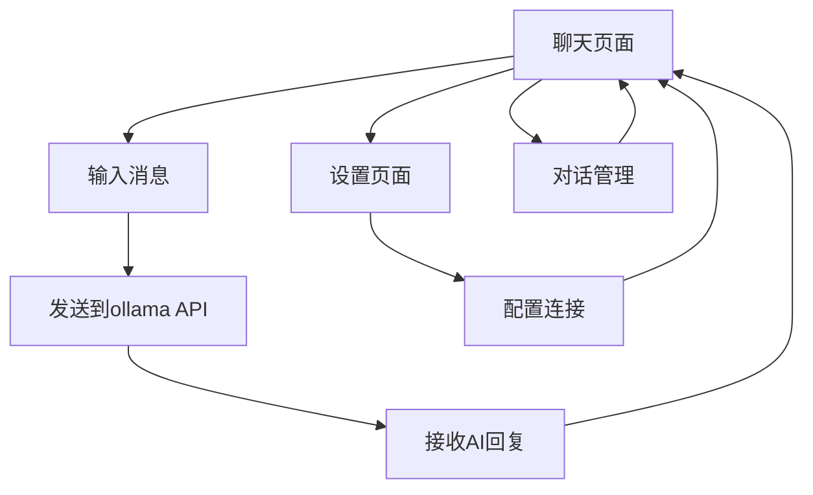

# AI对话应用产品需求文档

## 1. Product Overview
基于React + Vite + shadcn构建的本地AI对话应用，用户可以通过简洁的聊天界面与本地部署的ollama deepseek-r1:8b模型进行实时对话交互。
- 解决用户与本地AI模型便捷交互的需求，提供类似ChatGPT的对话体验
- 目标是为开发者和AI爱好者提供一个轻量级、易用的本地AI对话工具

## 2. Core Features

### 2.1 Feature Module
我们的AI对话应用包含以下核心页面：
1. **聊天页面**：消息显示区域、输入框、发送按钮、历史对话管理
2. **设置页面**：模型配置、API连接设置、界面主题切换

### 2.2 Page Details

| Page Name | Module Name | Feature description |
|-----------|-------------|---------------------|
| 聊天页面 | 消息显示区域 | 显示用户和AI的对话历史，支持markdown渲染，自动滚动到最新消息 |
| 聊天页面 | 消息输入框 | 支持多行文本输入，Enter发送，Shift+Enter换行，字符计数显示 |
| 聊天页面 | 发送控制 | 发送按钮，加载状态显示，取消请求功能 |
| 聊天页面 | 对话管理 | 新建对话，清空历史，导出对话记录 |
| 设置页面 | 连接配置 | ollama服务地址配置，模型选择，连接状态检测 |
| 设置页面 | 界面设置 | 深色/浅色主题切换，字体大小调整 |

## 3. Core Process

**用户对话流程：**
1. 用户打开应用进入聊天页面
2. 在输入框中输入问题或消息
3. 点击发送按钮或按Enter键发送消息
4. 系统调用ollama API发送请求到deepseek-r1:8b模型
5. 接收AI回复并在消息区域显示
6. 用户可以继续对话或管理历史记录

**设置配置流程：**
1. 用户点击设置按钮进入设置页面
2. 配置ollama服务地址和端口
3. 选择或确认使用的AI模型
4. 测试连接状态
5. 调整界面主题和显示设置

## 4. User Interface Design

### 4.1 Design Style
- **主色调**：深蓝色 (#1e40af) 和浅灰色 (#f8fafc)
- **次要色彩**：绿色 (#10b981) 用于成功状态，红色 (#ef4444) 用于错误提示
- **按钮样式**：圆角按钮，hover效果，shadcn/ui组件风格
- **字体**：系统默认字体，代码块使用等宽字体
- **布局风格**：现代卡片式设计，左右分栏布局
- **图标风格**：使用Lucide React图标库，简洁线性风格

### 4.2 Page Design Overview

| Page Name | Module Name | UI Elements |
|-----------|-------------|-------------|
| 聊天页面 | 消息显示区域 | 白色背景卡片，用户消息右对齐蓝色气泡，AI消息左对齐灰色气泡，支持代码高亮 |
| 聊天页面 | 输入区域 | 底部固定，白色背景，圆角输入框，右侧发送按钮，加载时显示spinner |
| 聊天页面 | 侧边栏 | 左侧对话历史列表，新建对话按钮，设置入口 |
| 设置页面 | 配置表单 | 标准表单布局，输入框和选择器，连接状态指示器 |

### 4.3 Responsiveness
应用采用移动端优先的响应式设计，在桌面端显示侧边栏，移动端使用抽屉式导航，支持触摸手势操作。