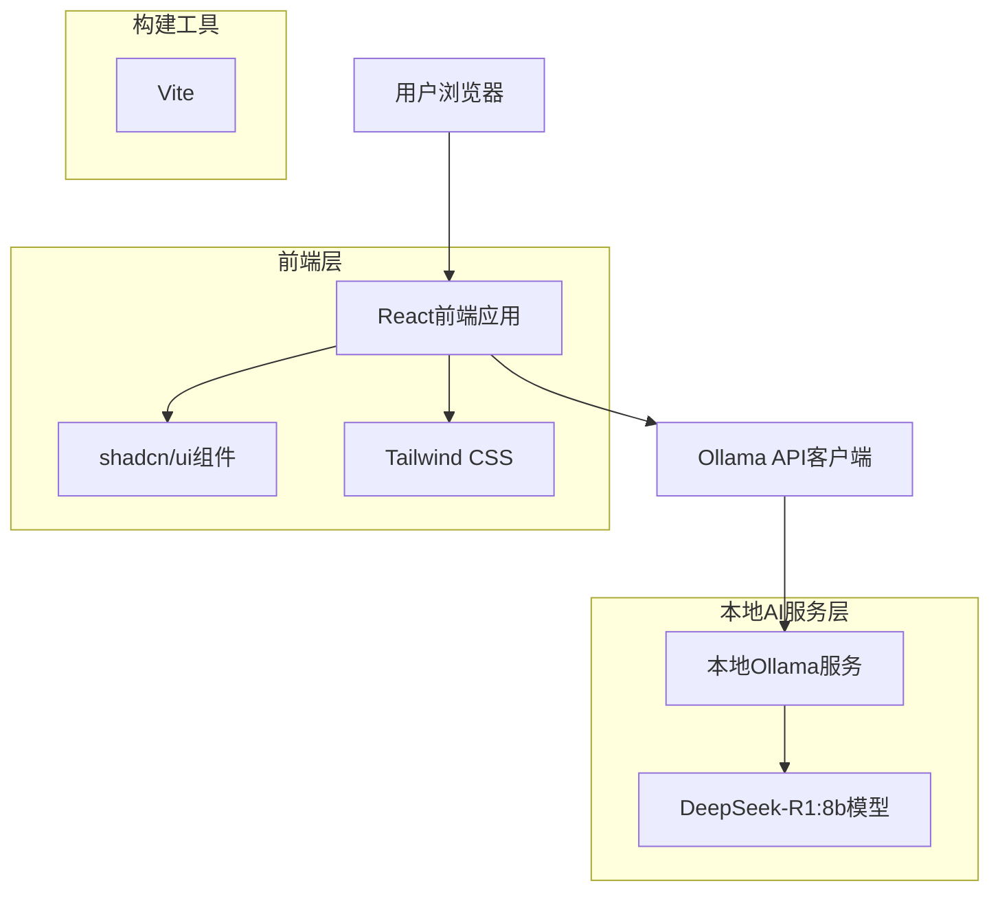
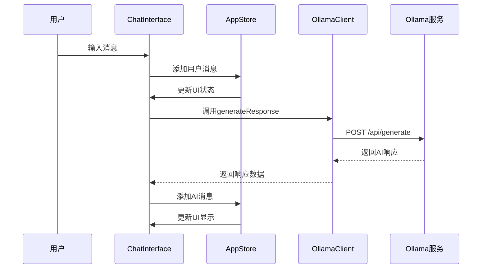
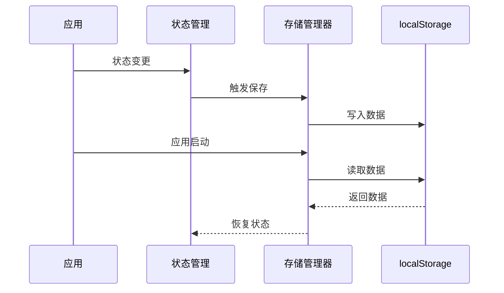

# AI对话应用技术架构文档

## 1. 项目概述

本项目是一个基于React + TypeScript的现代化AI对话应用，专门为本地Ollama AI服务设计。应用提供了直观的聊天界面，支持与DeepSeek-R1:8b等本地AI模型进行对话交互。

### 1.1 核心特性

* 🤖 本地AI模型集成（Ollama）

* 💬 实时对话界面

* 📱 响应式设计，支持移动端

* 🌙 深色/浅色主题切换

* 💾 本地数据存储

* ⚡ 流式和非流式响应支持

* 🎨 现代化UI设计（shadcn/ui）

### 1.2 技术亮点

* 零后端依赖，直接与本地Ollama服务通信

* TypeScript全栈类型安全

* 组件化架构，易于维护和扩展

* 本地存储管理，数据持久化

## 2. Architecture design



## 3. Technology Description

### 3.1 核心技术栈

* **前端框架**: React\@18 + TypeScript + Vite

* **UI组件库**: shadcn/ui + Radix UI

* **样式方案**: Tailwind CSS

* **构建工具**: Vite 6.3.5

* **包管理器**: pnpm

* **AI服务**: 本地Ollama + DeepSeek-R1:8b模型

### 3.2 开发工具

* **代码规范**: ESLint + TypeScript

* **样式处理**: PostCSS + Tailwind CSS

* **开发服务器**: Vite Dev Server

* **类型检查**: TypeScript 5.8.3

### 3.3 状态管理

* **全局状态**: Zustand store

* **本地状态**: React useState/useReducer

* **数据持久化**: localStorage + 自定义存储管理器

### 3.4 HTTP客户端

* **API调用**: 原生fetch API

* **错误处理**: 统一错误处理机制

* **请求拦截**: 自定义Ollama客户端类

## 4. 项目结构

```
src/
├── components/          # React组件
│   ├── chat/           # 聊天相关组件
│   │   ├── ChatInterface.tsx    # 主聊天界面
│   │   ├── MessageList.tsx      # 消息列表
│   │   ├── MessageInput.tsx     # 消息输入框
│   │   ├── Message.tsx          # 单条消息组件
│   │   └── Sidebar.tsx          # 侧边栏
│   ├── settings/       # 设置相关组件
│   ├── ui/            # 基础UI组件(shadcn/ui)
│   ├── theme-provider.tsx       # 主题提供者
│   └── theme-toggle.tsx         # 主题切换
├── hooks/              # 自定义Hook
│   ├── useConversations.ts      # 对话管理
│   ├── useSettings.ts           # 设置管理
│   └── useTheme.ts             # 主题管理
├── services/           # 服务层
│   └── ollama.ts               # Ollama API客户端
├── store/              # 状态管理
│   └── useAppStore.ts          # 全局状态
├── types/              # TypeScript类型定义
│   └── index.ts
├── utils/              # 工具函数
│   ├── helpers.ts              # 通用工具
│   └── storage.ts              # 存储管理
└── pages/              # 页面组件
    └── App.tsx                 # 主应用组件
```

## 5. Route definitions

| Route     | Purpose              |
| --------- | -------------------- |
| /         | 主聊天页面，显示对话界面和消息历史    |
| /settings | 设置页面，配置ollama连接和界面选项 |

## 6. 核心模块说明

### 6.1 聊天模块 (Chat)

* **ChatInterface**: 主聊天界面，协调各个子组件

* **MessageList**: 消息列表展示，支持滚动和加载

* **MessageInput**: 消息输入，支持多行文本和快捷键

* **Message**: 单条消息渲染，支持用户和AI消息样式

* **Sidebar**: 对话历史侧边栏，支持新建、删除对话

### 6.2 状态管理模块

* **useAppStore**: 全局状态管理，使用Zustand

* **useConversations**: 对话数据管理Hook

* **useSettings**: 应用设置管理Hook

### 6.3 服务模块

* **OllamaClient**: Ollama API客户端封装

  * 支持流式和非流式响应

  * 错误处理和重试机制

  * 连接状态检测

### 6.4 存储模块

* **StorageManager**: 本地存储管理器

  * 对话数据持久化

  * 设置数据同步

  * 数据导入导出

## 7. API definitions

### 7.1 Ollama API集成

与本地ollama服务通信

```
POST http://localhost:11434/api/generate
```

Request:

| Param Name | Param Type | isRequired | Description           |
| ---------- | ---------- | ---------- | --------------------- |
| model      | string     | true       | 模型名称 (deepseek-r1:8b) |
| prompt     | string     | true       | 用户输入的消息               |
| stream     | boolean    | false      | 是否流式响应                |

Response:

| Param Name | Param Type | Description |
| ---------- | ---------- | ----------- |
| response   | string     | AI生成的回复内容   |
| done       | boolean    | 是否完成生成      |

Example Request:

```json
{
  "model": "deepseek-r1:8b",
  "prompt": "你好，请介绍一下你自己",
  "stream": false
}
```

Example Response:

```json
{
  "response": "你好！我是DeepSeek-R1，一个AI助手...",
  "done": true
}
```

### 7.2 模型列表API

获取可用模型列表

```
GET http://localhost:11434/api/tags
```

Response:

| Param Name | Param Type | Description |
| ---------- | ---------- | ----------- |
| models     | array      | 可用模型列表      |

## 8. 数据流设计

### 8.1 消息发送流程



### 8.2 数据持久化流程



## 9. 数据模型

### 5.1 前端数据结构

```typescript
// 消息接口
interface Message {
  id: string;
  content: string;
  role: 'user' | 'assistant';
  timestamp: number;
}

// 对话接口
interface Conversation {
  id: string;
  title: string;
  messages: Message[];
  createdAt: number;
  updatedAt: number;
}

// 应用设置接口
interface AppSettings {
  ollamaUrl: string;
  selectedModel: string;
  theme: 'light' | 'dark';
  fontSize: 'small' | 'medium' | 'large';
}

// API响应接口
interface OllamaResponse {
  response: string;
  done: boolean;
  context?: number[];
}

// 模型信息接口
interface ModelInfo {
  name: string;
  size: number;
  digest: string;
  modified_at: string;
}
```

### 5.2 本地存储结构

使用localStorage存储用户数据：

```typescript
// 存储键名
const STORAGE_KEYS = {
  CONVERSATIONS: 'ai-chat-conversations',
  SETTINGS: 'ai-chat-settings',
  CURRENT_CONVERSATION: 'ai-chat-current'
};

// 存储的数据结构
interface StoredData {
  conversations: Conversation[];
  settings: AppSettings;
  currentConversationId: string | null;
}
```

## 10. 部署方案

### 10.1 开发环境部署

**前置要求:**

* Node.js 18+

* pnpm 包管理器

* 本地Ollama服务

**部署步骤:**

```bash
# 1. 克隆项目
git clone <repository-url>
cd local-ai

# 2. 安装依赖
pnpm install

# 3. 启动开发服务器
pnpm dev

# 4. 确保Ollama服务运行
ollama serve
ollama pull deepseek-r1:8b
```

### 10.2 生产环境部署

**构建应用:**

```bash
# 构建生产版本
pnpm build

# 预览构建结果
pnpm preview
```

**部署选项:**

1. **静态托管**: Vercel, Netlify, GitHub Pages
2. **自托管**: Nginx + 静态文件服务
3. **容器化**: Docker + Nginx

**Docker部署示例:**

```dockerfile
FROM node:18-alpine as builder
WORKDIR /app
COPY package*.json ./
RUN npm ci
COPY . .
RUN npm run build

FROM nginx:alpine
COPY --from=builder /app/dist /usr/share/nginx/html
EXPOSE 80
CMD ["nginx", "-g", "daemon off;"]
```

## 11. 性能优化

### 11.1 前端优化

* **代码分割**: 使用React.lazy()和Suspense

* **组件优化**: React.memo()防止不必要重渲染

* **虚拟滚动**: 长消息列表性能优化

* **图片优化**: 支持WebP格式，懒加载

### 11.2 网络优化

* **请求缓存**: 模型列表等静态数据缓存

* **连接复用**: 保持Ollama连接活跃

* **错误重试**: 指数退避重试机制

### 11.3 存储优化

* **数据压缩**: 大型对话数据压缩存储

* **清理策略**: 自动清理过期对话

* **增量更新**: 只更新变更的数据

## 12. 安全考虑

### 12.1 数据安全

* **本地存储**: 敏感数据仅存储在本地

* **数据加密**: 可选的对话内容加密

* **隐私保护**: 不向外部服务发送数据

### 12.2 网络安全

* **CORS配置**: 限制跨域请求

* **输入验证**: 防止XSS攻击

* **CSP策略**: 内容安全策略

## 13. 监控与调试

### 13.1 错误监控

* **错误边界**: React错误边界捕获

* **日志记录**: 结构化日志输出

* **性能监控**: Web Vitals指标

### 13.2 调试工具

* **React DevTools**: 组件状态调试

* **Network面板**: API请求监控

* **Console日志**: 详细的调试信息

## 14. 扩展性设计

### 14.1 模块化架构

* **插件系统**: 支持功能插件扩展

* **主题系统**: 可自定义UI主题

* **多语言**: 国际化支持框架

### 14.2 API扩展

* **多模型支持**: 支持不同AI模型

* **云服务集成**: 可扩展云端AI服务

* **自定义提示**: 支持系统提示词配置

## 15. 维护指南

### 15.1 代码维护

* **代码规范**: ESLint + Prettier

* **类型检查**: 严格的TypeScript配置

* **测试覆盖**: 单元测试和集成测试

### 15.2 依赖管理

* **定期更新**: 依赖包安全更新

* **版本锁定**: package-lock.json版本控制

* **安全扫描**: npm audit安全检查

### 15.3 文档维护

* **API文档**: 保持API文档同步

* **变更日志**: 记录重要变更

* **用户手册**: 用户使用指南

